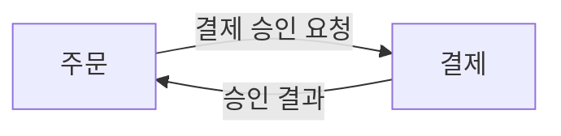

# DDD Builder

로컬 컴퓨터에서 실행하는 한국어 DDD 협업 워크숍입니다. 같은 네트워크의 팀원이 브라우저로 참여하고, 외부 AI는 MCP로 보드를 읽고 정리할 수 있습니다.

## 설계를 연결하고 검토하기

카드에 **가설·제안·합의** 상태와 검토 근거를 기록합니다. 합의에는 근거가 필요하며, 합의한 내용을 바꾸면 제안으로 돌아갑니다. 기존 카드는 제안으로 표시하고 합의를 자동으로 추정하지 않습니다. 단계별 카드 수는 작성 범위이며 설계 완성도 점수가 아닙니다.

**카드 연결**에서 나가는 방향으로 흐름·관련·선행 조건을 추가합니다. 이벤트 단계의 흐름은 행위자 → 명령 → 이벤트 → 정책 → 명령, 또는 이벤트 → 이벤트로 연결합니다. 초기에 사건만 수집해도 되며 연결은 나중에 보강할 수 있습니다. 이벤트와 컨텍스트 단계의 **흐름 보기**는 각각 흐름 연결과 관련 연결을 표시합니다. 정상·예외 흐름, 컨텍스트, 검토 상태로 좁혀 볼 수 있고, 정상·예외 필터에는 공통 카드도 포함합니다.

**컨텍스트 관계 형식**은 텍스트와 Mermaid를 지원합니다. 설명 텍스트와 다이어그램 원본을 각각 저장하므로 형식을 전환해도 작성한 내용이 유지됩니다. Mermaid는 코드 펜스 없이 본문만 입력합니다.



편집 화면에 미리보기를 표시하고 저장한 카드와 조회 화면에도 다이어그램을 보여 줍니다. 문법이 잘못되어도 원문은 유지됩니다. Mermaid 설정 지시문, 외부 리소스와 클릭 동작은 지원하지 않습니다. 다이어그램은 설명용이며 카드 연결을 자동으로 생성하지 않습니다. 그래프에서 연결하려면 카드 연결도 작성하세요.

**설계 점검**은 연결되지 않은 명령·정책, 컨텍스트 미분류, 루트·불변식 누락 등을 찾아 원래 카드로 이동합니다. 단계별 논의 질문도 제공합니다. 도메인 담당자의 검증이나 합의를 대신하지 않고 단계 이동을 막지 않습니다. 상세 검토와 남은 개선 과제는 [DDD 방법론·UI 검토](docs/reviews/2026-10-08-ddd-methodology-ui-review.md)에 기록했습니다.

### 컨텍스트 경계 지도

**컨텍스트 나누기**의 기본 화면은 **경계 보기**입니다. 점선 영역마다 소유한 이벤트·명령·정책·애그리게이트를 묶어 표시하고, 내부 카드 전체 보기에서 유형별로 펼칩니다. **경계 배치** 선택으로 카드를 다른 컨텍스트나 미분류로 옮기면 지도가 실시간 갱신됩니다. 조회자는 상세 확인만 할 수 있습니다. 이벤트 단계에서도 경계 보기로 전환할 수 있습니다.

영역 사이의 실선은 다른 컨텍스트로 향하는 실제 카드 흐름이며, 점선 연결은 컨텍스트 카드에 선언한 관련 관계입니다. 연결을 선택하면 방향별 원본 카드를 확인합니다. 연결과 분류는 카드 ID를 기준으로 하며 Mermaid나 제목에서 추정하지 않습니다. 미분류 카드는 별도 공간에 두고, 빈 컨텍스트도 표시합니다. 검색·검토 상태 등 필터는 내부 카드에 적용하며 경계는 유지합니다. 화면 너비와 연결 관계에 맞춰 영역을 자동 배치하며, 이동 손잡이를 드래그하거나 방향키로 위치를 조정할 수 있습니다. 연결선은 영역을 피해 다시 계산하고 **자동 배치**로 원래 배치 방식을 복원합니다. 수동 배치는 현재 보기에서만 유지됩니다. 텍스트·Mermaid 원문은 컨텍스트 편집 또는 내부 상세의 관계 설명에서 확인할 수 있습니다.

### 지도를 넓게 보고 배치 조정하기

경계 보기와 흐름 보기 모두 **화면 맞춤**, **기본 크기**, 확대·축소와 **넓게 보기**를 제공합니다. 배경 드래그나 스크롤로 이동할 수 있고, 넓게 보기에서도 카드 상세와 연결을 확인할 수 있습니다. 좁은 화면은 카드가 읽히는 크기로 내부 캔버스를 스크롤하며, 페이지 전체를 가로로 늘리지 않습니다.

흐름 보기의 **배치 방향**에서 자동·가로·세로를 선택합니다. 자동은 화면 너비와 그래프의 비율에 맞는 방향을 고릅니다. 연결된 이야기를 함께 배치하고 독립적인 흐름은 분리하며, 반복 경로는 카드 밖으로 돌려 표시합니다. 보기의 배치와 확대 비율을 바꾸어도 카드 소속이나 실제 연결은 바뀌지 않습니다.

### MCP 카드 필드

`create_card`와 `update_card`에서 다음 필드를 지원합니다. 기존 API/MCP 설정도 계속 사용할 수 있습니다.

| 필드                                | 값과 의미                                                                                           |
| ----------------------------------- | --------------------------------------------------------------------------------------------------- |
| `status`                            | `hypothesis`, `proposed`(기본), `agreed`                                                            |
| `decision`                          | 검토자·합의 근거 등의 텍스트. `agreed`에서는 필수                                                   |
| `scenario`                          | `shared`(기본), `main`, `exception`                                                                 |
| `links`                             | `[{"targetId":"같은 프로젝트의 카드 ID","kind":"flow"}]`. `related`, `dependsOn`도 지원. 최대 100개 |
| 컨텍스트 `data.relationships`       | 관계 설명 텍스트                                                                                    |
| 컨텍스트 `data.relationshipDiagram` | Mermaid 본문                                                                                        |
| 컨텍스트 `data.relationshipFormat`  | `text`(기본) 또는 `mermaid`                                                                         |

`update_card`에는 최신 `revision`이 필요합니다. 생략한 최상위 필드는 유지하지만, 전달한 `links` 배열과 `data` 객체는 전체 교체입니다. 기존 값을 읽고 보존하여 보내세요. 의미 있는 내용을 변경하면서 `status`를 생략하면 기존 합의가 제안으로 돌아갑니다. 명시적으로 합의를 유지하려면 변경 내용을 다시 검토하고 근거와 함께 지정하세요. `review_design`은 읽기 권한으로 프로젝트 전체의 점검 항목을 조회합니다. JSON·Markdown 내보내기에도 상태·연결·Mermaid 원문을 포함합니다.

## 애그리게이트 행동과 일관성 설계

**애그리게이트 설계 → 일관성 경계**에서 루트·내부 엔티티·값 객체와 업무 규칙을 함께 확인합니다. 경계 밖 애그리게이트 참조는 별도 영역에 표시합니다. **카드 보기**로 기존 카드 화면을 사용할 수도 있습니다.

**설계 편집**에서 같은 컨텍스트의 처리 명령을 연결하고, 규칙별로 보장하는 명령과 검증 사례를 기록합니다. 사례는 정상·거절/실패·동시성/중복 요청으로 구분하며 Given(상태)·When(행동)·Then(기대 결과)을 적습니다. 사례를 작성했다고 구현 테스트가 실행되거나 업무 규칙의 타당성이 증명되는 것은 아닙니다. 결과 사건은 명령 카드의 실제 흐름 연결에서 읽습니다. 거절된 명령이 항상 이벤트를 만든다고 가정하지 않습니다.

외부 참조에는 다른 애그리게이트의 ID와 참조 이유·전달할 식별자를 적습니다. 조정·실패 정책에는 지연·중복·타임아웃·재시도·보상을 기록합니다. 기존 `data.root/entities/valueObjects/invariants`와 자유 입력 규칙은 보존하며, 구조화된 규칙은 별도로 저장합니다. 탐색 중 비어 있는 설명이나 사례는 저장할 수 있고 설계 점검에서 검토 질문으로 표시합니다.

구조화된 `aggregateDesign`은 다음 형식입니다. 아래 ID는 예시이며 실제 보드의 카드 ID로 바꾸세요.

```json
{
  "commandIds": ["command-id"],
  "rules": [
    {
      "id": "minimum-lines",
      "statement": "접수된 주문에는 항목이 하나 이상이다",
      "commandIds": ["command-id"],
      "examples": [
        {
          "id": "empty-order",
          "title": "빈 주문 거절",
          "type": "rejection",
          "given": "항목이 없는 주문",
          "when": "주문 접수를 요청한다",
          "then": "거절하고 상태를 변경하지 않는다"
        }
      ]
    }
  ],
  "externalReferences": [
    {
      "aggregateId": "payment-aggregate-id",
      "reason": "결제 거래 ID를 참조한다"
    }
  ],
  "coordination": "승인 결과를 기다리고 중복 결과를 한 번 처리한다"
}
```

처리 명령은 같은 프로젝트·컨텍스트의 명령이어야 하며 한 명령의 처리 애그리게이트는 하나입니다. 여러 경계의 처리는 정책과 애플리케이션 조정으로 구분하세요. 외부 참조는 같은 프로젝트의 다른 애그리게이트여야 합니다. 규칙 ID는 애그리게이트 안에서, 사례 ID는 규칙 안에서 고유해야 합니다. 규칙 최대 40개, 규칙당 사례 최대 20개, 처리 명령 최대 100개, 외부 참조 최대 40개입니다. 요청 전체의 128 KiB 한도도 적용됩니다.

### MCP와 부분 수정

- `get_aggregate_design({aggregateId})`: 현재 버전, 처리 명령·결과 사건, 규칙·사례, 외부·역방향 참조와 점검 질문을 조회합니다.
- `patch_aggregate_design({aggregateId,revision,...})`: 최신 버전을 확인하고 ID별 규칙·사례만 수정합니다. 읽기 전용에서는 제공하지 않으며 서버도 편집 권한을 검사합니다.
- 리소스 `ddd://aggregates/{aggregateId}`와 `ddd://learning/{stage}`로 설계 및 화면과 동일한 학습 가이드를 읽습니다.
- 프롬프트 `analyze_aggregate_design({aggregateId})`로 경계·불변식·검증 사례·실패 대응을 검토합니다.

부분 수정 예시:

```json
{
  "aggregateId": "order-aggregate-id",
  "revision": 3,
  "upsertRules": [
    {
      "id": "minimum-lines",
      "upsertExamples": [
        { "id": "empty-order", "then": "거절하고 접수 이벤트를 만들지 않는다" }
      ]
    }
  ]
}
```

`upsertRules`는 같은 ID의 규칙에 제공한 필드만 반영하고, `upsertExamples`도 같은 방식으로 사례를 수정합니다. `removeRuleIds`와 규칙 안의 `removeExampleIds`는 지정한 기존 항목만 제거합니다. 새 ID는 새 항목을 추가합니다. 미지정한 규칙·사례·기존 데이터·카드 연결은 유지합니다. `commandIds`, `externalReferences`를 제공하면 해당 배열 전체를 교체합니다. 명령을 제거할 때는 관련 규칙의 명령도 함께 수정하세요. 합의한 설계의 내용이 바뀌면 제안으로 돌아갑니다. 409 충돌에서는 최신 설계를 다시 읽고 변경을 재검토하세요.

기존 `create_card`·`update_card`에서도 `aggregateDesign`을 지정할 수 있습니다. `update_card`에 제공한 `aggregateDesign`은 전체 교체이므로 부분 수정에는 새 도구를 사용하세요. 참조 대상을 삭제하면 처리 명령·외부 참조는 정리하고, 규칙 설명과 사례는 보존한 채 영향받은 합의를 제안으로 돌립니다. 이 기능은 한 카드의 변경만 원자적으로 처리하며 여러 카드의 일괄 변경 도구는 제공하지 않습니다.

## DDD 이론과 실습 학습하기

사이드바의 **DDD 학습 가이드** 또는 보드의 **이 단계 이론과 실습**에서 현재 단계에 맞는 설명을 엽니다. 각 단계에는 핵심 이론, 가상의 주문 도메인 예시, 보드 실습 순서, 흔한 오해, 팀 검토 질문과 해설이 있는 확인 문제가 있습니다. 단계 메뉴와 이전·다음 학습으로 내용을 탐색하고 **이 단계 보드에서 실습**으로 해당 보드로 이동합니다.

- 도메인 탐색: DDD의 목적, 유비쿼터스 언어, 핵심·지원·일반 서브도메인
- 이벤트 정리: 이벤트와 명령, 정책과 읽기 모델, EventStorming의 탐색 수준
- 컨텍스트 나누기: 모델의 경계, 상류·하류와 협력 패턴, 통합 계약
- 애그리게이트 설계: 엔티티·값 객체·루트, 불변식, 경계 밖 일관성과 서비스의 책임
- 구현 체크리스트: 유스케이스·계층·Repository, Given·When·Then 검증, CQRS·이벤트 소싱의 선택 기준

확인 문제의 답변은 창을 닫으면 초기화되며 보드 데이터나 설계 상태를 바꾸지 않습니다. 학습 예시를 실제 업무 규칙으로 적용하기 전에 도메인 담당자와 확인하세요. 각 단계의 원전 링크에서 더 깊이 읽을 수 있습니다.

## Docker Compose로 바로 실행하기

Docker Desktop 또는 Docker Engine과 Compose가 실행 중이면, 호스트에 Node나 SQLite를 설치하지 않고 시작할 수 있습니다. 기본 배포는 개인 계정 설정을 요구하는 공식 운영 모드입니다. 먼저 아래의 공식 서비스 인증 설정을 완료하세요. 설정 전 제한된 워크숍을 확인하려면 명시적으로 개발 모드를 선택합니다.

```sh
SERVICE_MODE=workshop AUTH_MODE=legacy docker compose up -d --build --wait
docker exec ddd-builder node -e "process.stdout.write(require('node:fs').readFileSync('/app/data/access-code','utf8'))"
```

`http://localhost:3210`을 열고 두 번째 명령으로 읽은 접속 코드를 입력합니다. 서버 로그에는 접속 코드를 기록하지 않습니다. 컨테이너 이름을 변경했다면 `docker exec`의 `ddd-builder`도 해당 이름으로 바꿉니다. 첫 명령이 화면 빌드와 서버 실행을 모두 처리합니다. 프로젝트와 접속 코드는 `workshop-data` 이름의 Docker 볼륨에 저장되어 재시작·업데이트 뒤에도 유지됩니다.

```sh
# 상태와 로그
docker compose ps
docker compose logs -f ddd-builder

# 종료 (저장 볼륨 유지)
docker compose down

# 다시 실행 또는 코드 업데이트 적용
docker compose up -d --build --wait
```

`docker compose down -v`는 저장 볼륨도 삭제합니다. 기존 `npm start` 서버가 3210 포트를 쓰고 있다면 종료하거나 아래 방법으로 Compose 포트를 바꿉니다.

### 포트와 팀원 접속 주소

기본 설정으로 바로 실행할 수 있으며, 변경이 필요할 때만 `.env.example`을 `.env`로 복사합니다.

```sh
cp .env.example .env
```

예를 들어 `.env`에 다음과 같이 설정하면 호스트의 3300 포트에서 접속을 받고, 앱의 **초대하기**에 호스트의 LAN 주소를 표시합니다. 주소는 실제 호스트 컴퓨터의 IP로 바꿔 주세요.

```dotenv
DDD_PORT=3300
DDD_BIND_ADDRESS=0.0.0.0
PUBLIC_URL=http://192.168.0.108:3300
```

설정 변경 후 `docker compose up -d --wait`를 실행합니다. 기본 호스트 바인딩은 `127.0.0.1`이며, LAN 공유는 위처럼 `DDD_BIND_ADDRESS=0.0.0.0`을 지정해 켭니다. Docker 안에서 보이는 내부 IP는 팀원 접속 주소로 표시하지 않습니다. `PUBLIC_URL`을 지정하지 않으면 `localhost` 주소가 표시되므로, 팀원에게는 호스트 컴퓨터의 LAN IP와 공개 포트를 전달하세요.

### Docker 실행에서 MCP 연결

앱의 **AI와 함께 설계하기 → MCP 설정 복사**를 사용합니다. Docker 실행에서는 호스트의 AI 클라이언트가 `docker exec -i`로 컨테이너 내부의 MCP에 연결하므로, 호스트에 Node를 설치할 필요가 없습니다. Docker가 실행 중이어야 하고, AI 클라이언트에서 `docker` 명령을 찾을 수 있어야 합니다. 찾지 못하면 설정의 `command`를 호스트의 Docker 실행 파일 절대 경로로 바꾸세요.

Node 실행 방식에서 복사했던 MCP 설정은 새 설정으로 교체합니다. **AI가 보드를 수정하도록 허용** 선택도 Docker MCP 프로세스에 전달되며, 기본값은 읽기 전용입니다. 이 Docker 설정은 Docker가 실행 중인 호스트의 AI 클라이언트용입니다.

### 기존 로컬 데이터 가져오기

직접 실행의 `data/` 폴더와 Docker 볼륨은 별도 저장소입니다. 기존 데이터를 가져올 때는 기존 `npm start` 서버와 Compose 앱을 먼저 종료하고, 대상 Docker 볼륨이 비어 있는 상태에서 아래 명령을 실행합니다. 기존 볼륨에 이미 작업이 있다면 먼저 백업하고 다른 저장소로 보관하세요.

```sh
docker compose create
docker compose stop
docker run --rm --user root --volumes-from ddd-builder \
  -v "$PWD/data:/source:ro" busybox:1.37.0 \
  sh -c 'cp -a /source/. /app/data/ && chown -R 1000:1000 /app/data'
docker compose up -d --wait
```

호스트의 원본 파일은 읽기 전용으로 사용하며 수정하지 않습니다. 원본 접속 코드도 함께 가져와 같은 코드로 입장할 수 있습니다.

### Docker 데이터 백업과 복원

앱을 잠시 정지한 상태에서 전체 볼륨을 백업합니다.

```sh
docker compose stop
mkdir -p backups
docker run --rm --user root --volumes-from ddd-builder:ro \
  busybox:1.37.0 tar -czf - -C /app/data . > backups/ddd-builder-data.tar.gz
docker compose start
```

복원할 때는 서버를 정지하고, 저장된 백업을 대상 볼륨에 풀어 줍니다. 아래 명령은 현재 데이터베이스를 백업 내용으로 교체합니다.

```sh
docker compose stop
docker run --rm -i --user root --volumes-from ddd-builder \
  busybox:1.37.0 sh -c 'rm -f /app/data/ddd-builder.sqlite /app/data/ddd-builder.sqlite-wal /app/data/ddd-builder.sqlite-shm; tar -xzf - -C /app/data && chown -R 1000:1000 /app/data' \
  < backups/ddd-builder-data.tar.gz
docker compose up -d --wait
```

컨테이너는 일반 사용자로 실행하고, 앱 코드가 있는 파일 시스템은 읽기 전용입니다. 메모리 512 MiB, CPU 1개, 프로세스 128개로 제한하며 Docker Desktop에서도 적용됩니다. 위의 백업·복원 명령은 `--user root`로 저장 볼륨만 관리합니다. 앱 데이터는 저장 볼륨에 기록합니다. 실행 이미지는 Node 런타임과 앱만 담은 Distroless로 셸·npm·cat이 없습니다. 데이터 관리에는 별도의 일회용 BusyBox 컨테이너를 사용합니다. 기존 볼륨과의 호환을 위해 앱 UID/GID는 1000입니다. 기본 명명 규칙에서 볼륨 이름은 `ddd-builder_workshop-data`입니다. Compose 프로젝트 이름을 바꾸면 저장 볼륨도 해당 프로젝트 이름을 따릅니다.

Compose의 환경 변수 설정 참고: [Docker 공식 문서](https://docs.docker.com/compose/how-tos/environment-variables/variable-interpolation/).

## Tailscale Funnel로 외부에 공유하기

호스트에 Tailscale을 설치하고 로그인한 뒤, Docker 앱을 실행한 상태에서 아래 명령으로 공개 HTTPS 주소를 만듭니다. 공유기 포트포워딩은 필요하지 않습니다.

```sh
docker compose up -d --build --wait
tailscale funnel --bg --https=443 http://127.0.0.1:3210
```

첫 실행에서 Funnel 활성화 승인 링크가 표시되면 브라우저에서 승인합니다. 출력된 `https://기기이름.네트워크이름.ts.net` 주소를 `.env`의 `PUBLIC_URL`로 지정하고 앱을 다시 실행합니다. 이 주소를 설정해야 외부 브라우저의 HTTPS 로그인과 초대 링크가 올바르게 동작합니다.

```dotenv
PUBLIC_URL=https://기기이름.네트워크이름.ts.net
```

```sh
docker compose up -d --build --wait
tailscale funnel status

# 외부 공유 종료 (로컬 앱과 저장 데이터는 유지)
tailscale funnel --https=443 off
```

외부 사용자는 HTTPS의 기본 포트인 **443**으로 접속하고, Funnel이 호스트의 **3210** 포트로 전달합니다. 접속자는 Tailscale을 설치하지 않고 앱의 기존 접속 코드로 입장합니다. 호스트 컴퓨터, Docker 앱, Tailscale은 실행 중이어야 하며, `--bg` 설정은 터미널 종료 뒤에도 유지됩니다.

공개 DNS 반영에는 최대 10분이 걸릴 수 있습니다. 사내 접속을 비교하려면 먼저 휴대폰 모바일 데이터에서 같은 주소를 확인하세요. 호스트 자체의 Tailscale 연결을 통한 접속 성공만으로 공개 인터넷 접속을 확인할 수는 없습니다.

MCP는 기존 **stdio**와 개인 토큰 인증 모드의 **Streamable HTTP(`/mcp`)**를 지원하며, 기존 웹 포트를 함께 사용합니다. 호스트에서는 앱의 Docker MCP 설정을 그대로 사용합니다. 다른 컴퓨터의 AI 클라이언트에는 저장소와 Node 24 이상을 준비하고 `npm ci`를 실행한 뒤, 해당 컴퓨터의 `mcp/index.mjs`를 실행하도록 설정합니다. `DDD_URL`은 Funnel의 HTTPS 주소, `DDD_CODE`는 기존 앱 접속 코드입니다. MCP 프로세스가 공개 HTTPS 주소의 **443** 포트로 앱 API에 연결합니다. 개인 토큰 인증 모드에서는 아래 HTTP MCP 설정으로 직접 연결할 수 있습니다.

공식 안내: [Tailscale Funnel](https://tailscale.com/docs/features/tailscale-funnel).

## Node로 직접 실행하기

Node.js **24 이상**이 필요합니다. SQLite는 Node에 내장된 모듈을 사용하므로 별도 데이터베이스 설치가 필요하지 않습니다.

```sh
npm ci
npm run build
npm start
```

브라우저에서 `http://localhost:3210`을 엽니다. 다른 터미널에서 `cat data/access-code`로 코드를 읽고 이름과 함께 입력합니다. `DATA_DIR`을 변경했다면 해당 폴더의 `access-code` 파일을 읽습니다. 서버 로그에는 파일 경로만 표시합니다. 처음 실행하면 수정 가능한 **온라인 주문 서비스** 예시 프로젝트가 만들어집니다.

종료는 터미널에서 `Ctrl+C`를 누릅니다. 다음에 `npm start`로 다시 실행하면 저장된 설계가 복구됩니다. 참여자는 다시 입장해야 합니다.

## 팀원과 함께 사용하기

1. 호스트 컴퓨터에서 `docker compose up -d --build --wait` 또는 `npm start`를 실행합니다.
2. 앱의 **초대하기**에서 `http://192.168.…:3210` 같은 로컬 네트워크 주소와 접속 코드를 팀원에게 전달합니다. `localhost`와 `127.0.0.1`은 호스트 컴퓨터에서 사용하는 주소입니다.
3. 팀원이 같은 네트워크에서 브라우저로 접속하고, 자신의 이름과 코드를 입력합니다.

서버는 기본적으로 `127.0.0.1:3210`에서 접속을 받습니다. 같은 네트워크에 공유하려면 Compose는 `DDD_BIND_ADDRESS=0.0.0.0`, Node 직접 실행은 `HOST=0.0.0.0 npm start`를 사용합니다. 호스트 컴퓨터가 켜져 있고 서버가 실행 중이어야 하며, 방화벽에서 해당 포트의 접속을 허용해야 합니다. 게스트 Wi-Fi의 기기 간 통신 차단이 있으면 접속할 수 없습니다.

같은 카드의 이전 버전을 저장하면 이미 저장된 내용을 덮어쓰지 않고 충돌을 표시합니다. 편집 중인 내용은 유지되며, 필요한 내용을 복사한 뒤 최신 내용을 불러올 수 있습니다. 연결이 끊겼다가 복구되면 전체 보드를 다시 받습니다.

공유 코드를 아는 참여자는 같은 작업 공간의 프로젝트를 읽고 수정할 수 있습니다. 이름은 표시용이며, 역할별 권한은 없습니다. 직접 실행의 서버는 HTTP를 사용합니다. 외부 공유는 위의 Tailscale Funnel HTTPS 구성을 사용하며, 지정한 `PUBLIC_URL`의 요청을 허용하고 HTTPS 접속의 세션 쿠키에 `Secure`를 적용합니다. 계정별 로그인과 역할별 권한은 포함하지 않습니다.

응답에는 CSP, 프레임 차단, `nosniff`, 권한 제한 헤더를 적용합니다. CSP는 같은 출처의 스크립트와 연결만 허용하며, 화면의 React 스타일을 위해 인라인 CSS를 허용합니다. HSTS는 명시한 HTTPS `PUBLIC_URL`의 호스트 요청에만 적용하며 로컬 HTTP에는 적용하지 않습니다. HTTPS 종료 프록시는 공개 호스트를 `Host`에 보존해야 합니다. 공개 HTTPS 호스트에 HTTP 출처를 붙인 변경 요청은 거부합니다.

고정 1분 창마다 API 요청은 소켓 IP당 1,200회, 코드 로그인 시도는 소켓 IP당 30회, 인증된 변경 요청은 세션당 300회로 제한합니다. 초과 요청은 `429`와 `Retry-After`를 반환합니다. 인증된 참여자의 허용된 출처 로그아웃은 API·변경 한도를 초과해도 세션과 SSE 연결을 종료할 수 있습니다. `X-Forwarded-For` 등 전달 헤더를 신뢰하지 않으므로 NAT 또는 Funnel 뒤의 참여자는 프록시 IP의 한도를 공유합니다. 각 한도 저장소는 최대 4,096개 키를 보관하고 만료된 키를 정리하며, 가득 차면 기존 카운터를 지우지 않고 새 키를 거부합니다. 활성 세션은 최대 200개로 12시간 유지하고, 실시간 SSE 연결은 전체 200개·세션당 5개로 제한합니다. 초과 연결은 기존 연결을 끊지 않습니다. 각 스트림의 대기 출력은 기본 1 MiB로 제한하며, 이를 초과하는 느린 참여자의 연결을 종료합니다. 로그아웃·만료 시에는 스트림과 소켓을 즉시 종료하고 실제 연결 종료 후 슬롯을 반환합니다. 초기 보드의 직렬화된 SSE 이벤트가 이 한도를 초과하면 연결을 열기 전에 JSON `413`을 반환하며 일반 API 조회와 내보내기는 계속 사용할 수 있습니다. 큰 보드를 사용하는 별도 서버 통합에서는 메모리 여유를 고려해 `security.maxSseBufferBytes`를 늘릴 수 있습니다. 테스트나 별도 서버 통합에서는 `createApp({ security: { ... } })`로 양의 정수 한도를 지정할 수 있고, 잘못된 설정은 데이터베이스를 열기 전에 거부합니다.

## 설계 흐름

| 단계              | 정리할 내용                                    |
| ----------------- | ---------------------------------------------- |
| 도메인 탐색       | 문제, 행위자, 공통 용어                        |
| 이벤트 정리       | 도메인 이벤트, 명령, 행위자, 정책, 미해결 질문 |
| 컨텍스트 나누기   | 각 영역의 책임·관계, 이벤트의 컨텍스트 분류    |
| 애그리게이트 설계 | 루트, 엔티티, 값 객체, 항상 지켜야 할 규칙     |
| 구현 체크리스트   | 작업, 담당자, 완료 상태                        |

단계는 자유롭게 오갈 수 있습니다. 카드를 클릭해 편집하고, 카드의 위·아래 화살표로 같은 유형 안에서 순서를 바꿉니다. **결과 내보내기**에서 모든 단계의 Markdown 문서 또는 JSON 데이터를 다운로드합니다.

## 외부 AI와 MCP로 협업하기

MCP 서버는 **stdio 전송**과 개인 토큰 인증 모드의 **Streamable HTTP 전송**을 지원합니다. 앱이 AI 모델을 실행하거나 API 키를 관리하지는 않습니다. 연결한 AI 클라이언트의 모델이 보드를 분석합니다.

1. DDD Builder 앱 서버를 실행해 둡니다.
2. 앱 왼쪽의 **AI와 함께 설계하기**를 엽니다.
3. **MCP 설정 복사**를 눌러 로컬 AI 클라이언트의 MCP 서버 설정에 추가합니다. 실행 방식에 맞는 Docker 또는 Node 명령과 앱 주소, 접속 코드가 포함됩니다.
4. 클라이언트가 JSON 설정을 사용하지 않으면 표시된 `command`, `args`, `env`를 해당 클라이언트의 MCP 설정 형식으로 옮깁니다.
5. 클라이언트에서 프로젝트 목록을 읽고 분석을 요청합니다. 앱에서 **분석 요청 복사**를 누르면 프로젝트 ID가 포함된 요청문을 얻습니다.

설정 형식 예시입니다. 실제 값은 앱에서 복사해 사용하세요.

```json
{
  "mcpServers": {
    "ddd-builder": {
      "command": "/absolute/path/to/node",
      "args": ["/absolute/path/to/ddd-builder/mcp/index.mjs"],
      "env": {
        "DDD_URL": "http://127.0.0.1:3210",
        "DDD_CODE": "호스트의 접속 코드",
        "DDD_READ_ONLY": "true"
      }
    }
  }
}
```

처음에는 읽기 전용입니다. **AI가 보드를 수정하도록 허용**을 선택하고 설정을 다시 복사하면 카드 추가·수정 도구가 활성화됩니다. AI가 저장한 내용은 `AI 도우미` 이름으로 표시되고 참여자에게 실시간 공유됩니다. 기존 카드 수정에는 현재 `revision`이 필요하며, 사람과 동일한 충돌 검사를 적용합니다.

| MCP 기능                     | 용도                                                                |
| ---------------------------- | ------------------------------------------------------------------- |
| `list_projects`              | 프로젝트 목록과 ID 조회                                             |
| `get_project_board`          | 프로젝트 및 단계별 카드, 컨텍스트 조회                              |
| `review_design`              | 설계의 연결·입력 누락과 미합의 항목 점검                            |
| `get_aggregate_design`       | 명령·규칙·사례·외부 참조를 포함한 애그리게이트 설계 조회            |
| `patch_aggregate_design`     | 최신 버전을 확인하고 규칙·사례 ID별 부분 수정 · 수정 허용 시 활성화 |
| `create_card`                | 새 카드 추가 · 수정 허용 시 활성화                                  |
| `update_card`                | 현재 버전을 확인한 카드 수정 · 수정 허용 시 활성화                  |
| `ddd://projects`             | 프로젝트 목록 리소스                                                |
| `ddd://projects/{projectId}` | 프로젝트의 전체 보드 리소스                                         |
| `analyze_event_storming`     | 중복·누락·경계·규칙을 검토하는 분석 프롬프트                        |

예: “주문 서비스의 이벤트 스토밍 결과를 읽고, 중복 이벤트와 빠진 명령·정책을 찾아 줘. 바운디드 컨텍스트 경계와 애그리게이트를 제안해 줘. 먼저 제안을 보여 준 다음, 내가 요청하면 보드를 수정해 줘.”

다른 컴퓨터의 로컬 AI 클라이언트에서도 연결할 수 있습니다. 그 컴퓨터에 이 프로젝트와 Node를 준비하고 `npm ci`를 실행한 다음, MCP 설정의 실행 경로를 해당 컴퓨터의 경로로 바꾸고 `DDD_URL`을 호스트의 로컬 네트워크 주소로 변경합니다. `DDD_CODE`는 같은 접속 코드를 사용합니다. 공유 코드 개발 모드에서는 stdio를 사용합니다. 개인 토큰 인증 모드에서는 `/mcp`에 직접 연결할 수 있습니다.

MCP 공식 개념과 연결 방식: [MCP 서버 개발 가이드](https://modelcontextprotocol.io/docs/develop/build-server).

## 저장과 백업

- 기본 저장 위치: 프로젝트의 `data/ddd-builder.sqlite`.
- 접속 코드: `data/access-code`. 서버 재시작 후에도 유지됩니다.
- 프로젝트별 데이터 보관: 앱의 **결과 내보내기 → JSON 백업**. 현재 앱에는 JSON 가져오기 기능이 없습니다.
- 완전한 백업과 복원: 서버를 종료한 뒤 `data/` 폴더 전체를 복사합니다. 복원할 때도 서버를 종료한 상태에서 해당 폴더를 교체합니다. 앱은 이를 다음 시작 때 읽습니다.
- `data/`와 인증 정보는 Git에 포함하지 않습니다.

## 실행 설정

| 환경 변수            | 기본값                                     | 설명                                                                             |
| -------------------- | ------------------------------------------ | -------------------------------------------------------------------------------- |
| `HOST`               | `127.0.0.1`                                | 서버가 접속을 받을 주소. LAN 공유는 `0.0.0.0`. Compose 컨테이너 내부는 `0.0.0.0` |
| `PORT`               | `3210`                                     | 서버 포트                                                                        |
| `DATA_DIR`           | 프로젝트의 `data/`                         | 저장 폴더                                                                        |
| `ACCESS_CODE`        | 생성 후 파일에 보관                        | 원하는 접속 코드로 변경. 서버를 재시작해야 적용                                  |
| `PUBLIC_URL`         | 직접 실행은 자동 발견 · Docker는 localhost | 초대하기에 표시할 호스트의 외부 접속 주소                                        |
| `MCP_CONTAINER_NAME` | 직접 실행은 없음 · Compose는 ddd-builder   | Docker에서 MCP 실행에 사용할 컨테이너 이름                                       |
| `DDD_PORT`           | `3210`                                     | Compose가 호스트에 공개할 포트. 컨테이너 내부 포트는 3210                        |
| `DDD_BIND_ADDRESS`   | `127.0.0.1`                                | Compose의 호스트 접속 주소. LAN 공유는 `0.0.0.0`                                 |
| `DDD_CONTAINER_NAME` | `ddd-builder`                              | Compose 컨테이너 이름. 자동 MCP 설정에도 반영                                    |
| `DDD_URL`            | `http://127.0.0.1:3210`                    | MCP가 연결할 앱 주소                                                             |
| `DDD_CODE`           | 없음                                       | MCP 접속 코드 · 필수                                                             |
| `DDD_READ_ONLY`      | `true`                                     | MCP 카드 수정은 정확히 `false`로 지정할 때 허용                                  |
| `DDD_AI_NAME`        | `AI 도우미`                                | MCP 변경의 작성자 이름                                                           |

macOS/Linux 실행 예:

```sh
PORT=3300 npm start
```

## 개발 및 검증

```sh
npm run dev
```

API는 `3210`, 개발 화면은 `5173`에서 실행됩니다. 개발 화면은 API를 프록시합니다. 팀 사용은 빌드 후 단일 포트로 제공하는 `npm start`가 기본입니다.

```sh
npm test
npm run build
npx playwright install chromium
npm run test:e2e
# Docker가 실행 중인 환경에서 별도 임시 볼륨으로 통합 검증
npm run test:docker
```

Node 테스트는 임시 폴더에서 실제 HTTP와 MCP 클라이언트를 사용해 인증, 보안 헤더, 요청·세션·SSE 한도, 저장 복구, 충돌, 동시 요청, 내보내기, stdio 및 HTTP MCP 연결과 토큰 격리를 검증합니다. 브라우저 테스트는 별도 포트 `3211`과 `test-results/e2e-data`를 사용합니다.

## 공식 서비스 인증과 보안

기본 Compose 배포는 `production` 모드이며 OIDC 설정이 없으면 시작하지 않습니다. 명시적으로 선택하는 `workshop` 모드는 공유 코드 워크숍용입니다. 공식 서비스에서는 초대받은 개인의 OIDC 계정, 프로젝트별 관리자·편집자·조회자 권한, 감사 기록을 사용합니다. 읽기 전용 권한은 REST·내보내기·실시간 연결·MCP에서 모두 적용합니다.

Git에서 제외된 `.env`에 다음 항목을 설정합니다. 비밀키를 채팅이나 저장소에 넣지 마세요.

```dotenv
SERVICE_MODE=production
AUTH_MODE=oidc
PUBLIC_URL=https://sol-macmini-2.tail6d02c8.ts.net
DDD_BIND_ADDRESS=127.0.0.1
OIDC_ISSUER=https://accounts.google.com
OIDC_CLIENT_ID=공급자에서_발급한_Client_ID
OIDC_CLIENT_SECRET=로컬에만_입력하는_비밀키
OWNER_EMAIL=최초_관리자의_검증된_이메일
```

공급자에 등록할 redirect URI는 `https://sol-macmini-2.tail6d02c8.ts.net/api/auth/callback`입니다. 요청 범위는 `openid email profile`입니다. 서명된 ID 토큰에 `email_verified=true`를 제공하는 공급자가 필요합니다. Google 예시는 [인증 설정 가이드](docs/security/identity-setup.md)를 따릅니다.

최초 관리자 로그인 때 기존 프로젝트를 해당 관리자에게 한 번만 귀속합니다. 기존 카드와 이력은 보존합니다. 이후에는 관리자 이메일이 같아도 다른 issuer/subject를 자동으로 연결하지 않으며, 재시작해도 철회한 프로젝트 권한을 되살리지 않습니다. 운영 모드의 인증 설정이 누락되거나 HTTPS가 아니면 서버는 시작하지 않습니다. 개발 모드로 자동 대체하지 않습니다.

관리자는 **멤버 관리**에서 이메일·권한으로 초대를 등록하고 접속 주소를 직접 전달합니다. 초대는 7일 후 만료됩니다. 개인별 세션은 최대 12시간이고 30분간 요청이 없으면 만료됩니다. 마지막 활성 프로젝트/운영 관리자를 제거하려면 먼저 다른 관리자에게 권한을 이전해야 합니다.

**외부 AI 연결**에서 프로젝트에 제한된 개인 MCP 토큰을 생성합니다. 기본은 읽기이고 최대 30일 후 만료됩니다. 토큰 원문은 생성할 때만 표시하며 서버에는 해시만 보관합니다. 조회자는 읽기 토큰만 생성할 수 있고, 쓰기 토큰도 해당 프로젝트 카드 편집으로 제한됩니다. 토큰 철회·계정 차단·프로젝트 권한 변경은 서버에서 즉시 적용됩니다. 다른 컴퓨터의 AI 클라이언트는 저장소를 설치한 뒤 아래와 같이 로컬 MCP 프로세스를 실행합니다.

```json
{
  "mcpServers": {
    "ddd-builder": {
      "command": "/your/local/node",
      "args": ["/your/local/ddd-builder/mcp/index.mjs"],
      "env": {
        "DDD_URL": "https://sol-macmini-2.tail6d02c8.ts.net",
        "DDD_TOKEN": "앱에서_생성한_개인_토큰",
        "DDD_READ_ONLY": "true"
      }
    }
  }
}
```

stdio와 HTTP MCP 모두 별도 인터넷 포트를 열 필요가 없습니다. 웹과 MCP의 데이터 요청은 같은 HTTPS 서비스로 전달되며, 내부 앱 포트는 3210, Funnel의 공개 포트는 443입니다. `DDD_READ_ONLY=false`로 클라이언트 설정을 바꿔도 서버의 읽기 토큰 권한을 넘을 수 없습니다.

### HTTP MCP로 직접 연결하기

개인 계정 인증(`AUTH_MODE=oidc`)에서는 **외부 AI 연결 → HTTP · 원격 URL 연결**을 선택하고 개인 토큰을 생성합니다. Streamable HTTP와 사용자 지정 Authorization 헤더를 지원하는 클라이언트는 로컬 Node나 저장소 설치 없이 연결할 수 있습니다. 예시 설정이며 필드 이름은 사용하는 클라이언트에 맞춰 조정하세요.

```json
{
  "mcpServers": {
    "ddd-builder": {
      "url": "https://your-service.example/mcp",
      "headers": {
        "Authorization": "Bearer 앱에서_생성한_개인_토큰"
      }
    }
  }
}
```

`PUBLIC_URL`을 실제 HTTPS 서비스 주소로 설정하면 화면에 해당 `/mcp` 주소가 표시됩니다. Docker와 Funnel에서도 기존 웹 포트를 사용합니다. 개인 토큰은 모든 요청에서 검증하며 프로젝트 범위, 만료, 철회 및 현재 멤버 권한을 적용합니다. 읽기 토큰에는 조회 도구만 제공하고 쓰기 토큰에는 카드 생성·수정 도구를 추가합니다.

HTTP MCP는 요청별 서버를 사용하는 stateless 방식이며 POST에 JSON 응답을 반환합니다. 별도 MCP 세션이나 장기 SSE 연결은 만들지 않습니다. Origin이 있으면 설정된 서비스 주소와 일치해야 합니다. 공유 코드(`AUTH_MODE=legacy`)와 브라우저 세션 쿠키는 HTTP MCP 인증으로 받지 않습니다. 기존 stdio 설정은 계속 사용할 수 있습니다.

이 엔드포인트는 개인 Bearer 토큰 방식이며 MCP OAuth 자동 로그인·토큰 발급 탐색은 제공하지 않습니다. 웹 계정의 OIDC 로그인과는 별개입니다. OAuth만 지원하고 사용자 지정 Bearer 헤더를 지원하지 않는 클라이언트는 현재 직접 연결할 수 없습니다.

보안 정책과 실제 운영 조건은 [SECURITY.md](SECURITY.md), [통제 현황](docs/security/controls.md), [운영 절차](docs/security/operations.md), [데이터 처리 정책](docs/security/privacy.md)를 확인하세요. 실제 공급자 로그인·관리자 MFA·보안 연락처·외부 암호화 백업·복원 훈련·경보를 완료하기 전에는 공식 출시 준비 완료로 판정하지 않습니다.

## 라이선스

DDD Builder의 소스 코드와 문서는 [MIT 라이선스](LICENSE)로 제공합니다. 상업적 이용·수정·재배포를 허용하며, 복제본이나 소프트웨어의 상당 부분에 저작권 표시와 라이선스 전문을 포함해야 합니다. 외부 의존성에는 각각의 라이선스가 적용됩니다.
